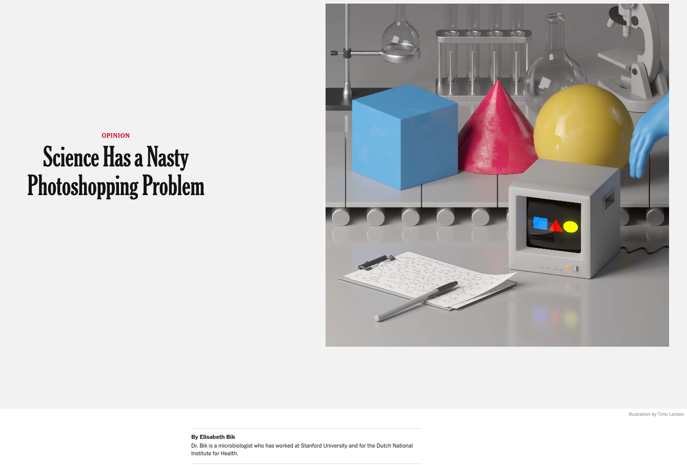
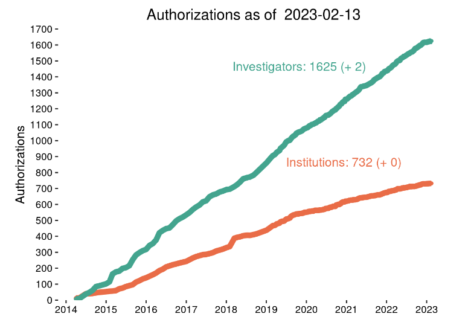

```{r setup, include=FALSE}
knitr::opts_chunk$set(echo = FALSE)
```

# Why we're here

---

<iframe width="1068" height="600" src="https://www.youtube.com/embed/66oNv_DJuPc" title="YouTube video player" frameborder="0" allow="accelerometer; autoplay; clipboard-write; encrypted-media; gyroscope; picture-in-picture; web-share" allowfullscreen></iframe>

[@NYU_Health_Sciences_Library2013-gp](https://www.youtube.com/watch?v=66oNv_DJuPc)

---
 
```{r, fig.cap="[@Baker2016-rz](https://doi.org/10.1038/533452a)"}
knitr::include_graphics("http://www.nature.com/polopoly_fs/7.36716.1469695923!/image/reproducibility-graphic-online1.jpeg_gen/derivatives/landscape_630/reproducibility-graphic-online1.jpeg")
```

---

```{r, fig.cap="Is there a reproducibility crisis in your area of research?", out.width="80%"}
knitr::include_graphics("https://penn-state-open-science.github.io/survey-fall-2022/include/img/fig-repro-crisis-your-area-1.png")
```

---

```{r, fig.cap="[@Bik2022-hl](https://www.nytimes.com/interactive/2022/10/29/opinion/science-fraud-image-manipulation-photoshop.html)"}

```

---

>"*...**you must not fool yourself—and you are the easiest person to fool**...After you’ve not fooled yourself, it’s easy not to fool other scientists.*"
>
> -- [@Feynman1974-ld](https://calteches.library.caltech.edu/51/2/CargoCult.htm)

---

>"*...I’m talking about a specific, **extra type of integrity** that is not lying, but **bending over backwards to show how you’re maybe wrong**, that you ought to do when acting as a scientist. And this is our responsibility as scientists, certainly to other scientists, and I think to laymen.*"
>
> -- [@Feynman1974-ld](https://calteches.library.caltech.edu/51/2/CargoCult.htm)

# Penn State Open Science Survey

## {data-background-iframe="https://forms.gle/eUGyWJPL226UNHfb8"}

## {data-background-iframe="https://penn-state-open-science.github.io/survey-fall-2022/"}

## {data-background-iframe="https://penn-state-open-science.github.io/survey-fall-2022/data-visualization.html"}

---

Link to the survey:

```{r, echo=FALSE}
library(qrcode)
code <- qr_code("https://forms.gle/eUGyWJPL226UNHfb8")
plot(code)
```

# Experience & awareness of open science practices

---

```{r, out.width="80%", fig.cap="What is your experience with/knowledge of open science practices?"}
knitr::include_graphics("https://penn-state-open-science.github.io/survey-fall-2022/include/img/fig-experience-w-open-science-1.png")
```

## Research data should be...

. . .

- **F**indable
- **A**ccessible
- **I**nteroperable
- **R**eusable

[@Wilkinson2016-qr](http://dx.doi.org/10.1038/sdata.2016.18)

---

```{r, out.width="70%", fig.cap="Describe your awareness of the FAIR (findable, accessible, interoperable, reusable) principles pertaining to research data"}
knitr::include_graphics("https://penn-state-open-science.github.io/survey-fall-2022/include/img/fig-awareness-FAIR-1.png")
```


---

```{r, out.width="80%", fig.cap="Do you apply FAIR principles in your own data management and sharing practices?"}
knitr::include_graphics("https://penn-state-open-science.github.io/survey-fall-2022/include/img/fig-apply-FAIR-own-research-1.png")
```

# Data characteristics

---

```{r, fig.cap="What are the primary types of digital data that are used in your research?", out.width="80%"}
knitr::include_graphics("https://penn-state-open-science.github.io/survey-fall-2022/include/img/fig-primary-data-types-1.png")
```

---

```{r, fig.cap="Do you collect data that have legal or ethical restrictions governing who may access it or how it may be used?", out.width="80%"}
knitr::include_graphics("https://penn-state-open-science.github.io/survey-fall-2022/include/img/restricted-data-preprocess-1.png")
```

---

```{r, fig.cap="Where do you store data for active projects where data collection and analysis is still ongoing?", out.width="80%"}
knitr::include_graphics("https://penn-state-open-science.github.io/survey-fall-2022/include/img/fig-data-storage-places-1.png")
```

# Sharing with collaborators

---

```{r, out.width="70%", fig.cap="How important to you is sharing data from active projects with research collaborators at Penn State or outside of Penn State?"}
knitr::include_graphics("https://penn-state-open-science.github.io/survey-fall-2022/include/img/fig-import-share-collab-1.png")
```

---

```{r, fig.cap="How convenient is it for you to share data from active projects with research collaborators at Penn State or outside of Penn State?", out.width="70%"}
knitr::include_graphics("https://penn-state-open-science.github.io/survey-fall-2022/include/img/fig-convenient-share-collab-1.png")
```

## {data-background-iframe="https://penn-state-open-science.github.io/survey-fall-2022/data-visualization.html#barriers-to-sharing-with-research-collaborators"}

# Sharing with community

---

```{r, fig.cap="How important to you is sharing data from completed projects with the broader research community (i.e., not direct collaborators)?", out.width="70%"}
knitr::include_graphics("https://penn-state-open-science.github.io/survey-fall-2022/include/img/fig-import-share-community-1.png")
```

---

```{r, fig.cap="Which of the following obstacles make sharing data with the research community harder for you?", out.width="70%"}
knitr::include_graphics("https://penn-state-open-science.github.io/survey-fall-2022/include/img/fig-obstacles-to-sharing-w-comm-1.png")
```

---

```{r, fig.cap="If you have shared data with the research community, where have you shared it?", out.width="80%"}
knitr::include_graphics("https://penn-state-open-science.github.io/survey-fall-2022/include/img/fig-where-data-shared-1.png")
```

---

```{r, out.width="70%", fig.cap="How often do you openly share other materials related to your research (protocols, reagents, samples, apparatus, designs, etc.) with other researchers?"}
knitr::include_graphics("https://penn-state-open-science.github.io/survey-fall-2022/include/img/fig-share-materials-community-1.png")
```

# Sharing requirements

---

```{r, out.width="80%", fig.cap="Do research funders in your field require data sharing?"}
knitr::include_graphics("https://penn-state-open-science.github.io/survey-fall-2022/include/img/fig-funders-require-data-sharing-1.png")
```

---

```{r, out.width="80%", fig.cap="Do journals in your field require data sharing?"}
knitr::include_graphics("https://penn-state-open-science.github.io/survey-fall-2022/include/img/fig-journals-require-data-sharing-1.png")
```

# Sharing image & video data

## The challenge

</br></br></br>

. . .

Images/video of people pose risks of identification

## (One) solution

</br></br></br>

. . .

Alter images/videos

. . .

---

```{r, fig.cap="https://www.fiverr.com/visionesque/blur-faces-objects-brands-or-anything-else-in-your-video"}
knitr::include_graphics("https://fiverr-res.cloudinary.com/images/t_main1,q_auto,f_auto,q_auto,f_auto/gigs/49647129/original/50b3952f2fcb3e81874e1aca222281240d11b934/blur-faces-objects-brands-or-anything-else-in-your-video.png")
```

## But, altering images/video...

</br></br></br>

. . .

is time/resource consuming</br></br>

. . .

makes images/video less valuable for reuse by others</br></br>

. . .

might pose risks to participants (if using external service)

## (Another) solution

</br></br></br>

. . .

Share with *researchers* not with the public

. . .

Researchers with ethics training

. . .

Researchers subject to institutional supervision
  
## Share with participant permission

</br></br></br>

. . .

Share only with research team members OR </br>

. . .

Share with other researchers OR </br>

. . .

Share with other researchers + allow clips to be shown OR </br>

. . .

Share publicly

## {data-background-iframe="https://databrary.org/"}

## About Databrary

</br></br>

. . .

Video data library for researchers in the behavioral sciences</br></br>

. . .

Restricted access data repository</br></br>

. . .

Housed at NYU; staff at NYU & PSU</br></br>

. . .

World's only repository dedicated to storing and sharing video/audio and other identifiable data</br></br>

---

```{r, fig.cap="Databrary investigators & institutions 2014-"}

```

## {data-background-iframe="https://databrary.org/about/agreement.html"}

---

Institutional authorization via formal [Databrary Access Agreement](https://databrary.org/about/agreement.html)

</br></br></br>

Institution signs & Investigator (sometimes)

---

```{r, fig.cap="Map of Databrary-authorizing institutions as of 2023-02-22."}
knitr::include_graphics("include/img/databrary-inst-map-2023-02-22.png")
```

---

</br></br></br>

If you're a grad student or postdoc, you can apply to be an Affiliate user, with access tied to your PI.

## {data-background-iframe="https://databrary.org/support/irb.html"}

## {data-background-iframe="https://databrary.org/support/irb/release-template.html"}

## {data-background-iframe="https://databrary.org/support/irb/script.html"}

## {data-background-video="https://databrary.org/video/example-video-1.mp4"}

## {data-background-iframe="https://databrary.org/support/irb/release-levels.html"}

# Why share images & video?

---

```{r, fig.cap="[@Gilmore2017-wd](https://doi.org/10.1038/s41562-017-0128)"}
knitr::include_graphics("include/img/gilmore-adolph-nat-hum-beh-2017.png")
```

## Images and video are essential to the study of *behavior*

## {data-background-video="https://www.anhourinthelife.org/img/PLAY-parents-noaudio.mp4"}

## Play & Learning Across a Year (PLAY) Project

[https://play-project.org](https://play-project.org)

</br></br>
1 hour of natural behavior in the home</br></br>
Mothers & 12-, 18-, and 24-month-old infants</br></br>
Health, vocabulary, temperament, [demographic measures](https://PLAY-behaviorome.github.io/KoBoToolbox/)</br></br>

. . .

All protocols openly shared and documented on **video**.

## {data-background-iframe="https://www.play-project.org/collection.html"}

# Other types of images...

## Back to Elizabeth Bik

```{r, fig.cap="[@Bik2022-hl](https://www.nytimes.com/interactive/2022/10/29/opinion/science-fraud-image-manipulation-photoshop.html)"}

```

## *Script* figure/image manipulations wherever possible

```{r}

```

## [@Qian2022-yp](http://dx.doi.org/10.1038/s41598-022-22269-y)

```{r, fig.cap="Figure 1 from [@Qian2022-yp](http://dx.doi.org/10.1038/s41598-022-22269-y)"}
knitr::include_graphics("https://media.springernature.com/full/springer-static/image/art%3A10.1038%2Fs41598-022-22269-y/MediaObjects/41598_2022_22269_Fig1_HTML.png?as=webp")
```

## {data-background-image="include/img/qian-etal-github-fig-code.png"}

# Your thoughts?

# Open science @ PSU

---

```{r, out.width="70%", fig.cap="How much benefit would you derive from a center at Penn State focused on supporting the adoption of best practices in data management and sharing, code sharing, open science, and reproducible research?"}
knitr::include_graphics("https://penn-state-open-science.github.io/survey-fall-2022/include/img/fig-benefit-from-psu-ctr-1.png")
```

---

```{r, out.width="80%", fig.cap="Select the services that would most benefit your research if offered by such a center."}
knitr::include_graphics("https://penn-state-open-science.github.io/survey-fall-2022/include/img/fig-services-from-center-1.png")
```

## {data-background-image="include/img/penn-state-open-science-github.png"}


## Take homes

</br></br>

. . .

Images and video *can* be shared

. . .

Images and video *should* be shared

. . .

Images and video *are already being* shared

</br></br>

. . .

Let's share images and video...

to improve transparency and reproducibility

. . .

and accelerate discovery

---

```{r, fig.cap="Source: https://media2.giphy.com/media/BpGWitbFZflfSUYuZ9/giphy.gif"}
knitr::include_graphics("https://media2.giphy.com/media/BpGWitbFZflfSUYuZ9/giphy.gif")
```

# Resources

---

This talk was produced on `r Sys.Date()` in [RStudio](http://rstudio.com/) using [R Markdown](https://rmarkdown.rstudio.com) and the [reveal.js](https://revealjs.com) framework.

Information about the R Session that produced the code is as follows:

```{r session-info}
sessionInfo()
```

## Code

**GitHub repo**: <https://github.com/penn-state-open-science/>

**Survey protocol & results**: <https://penn-state-open-science.github.io/survey-fall-2022/>

---

**Talk slides**: <https://penn-state-open-science.github.io/2023-03-01-PSU-SARI/>

```{r, echo=FALSE}
library(qrcode)
code <- qr_code("https://penn-state-open-science.github.io/2023-03-01-PSU-SARI/")
plot(code)
```

## References
